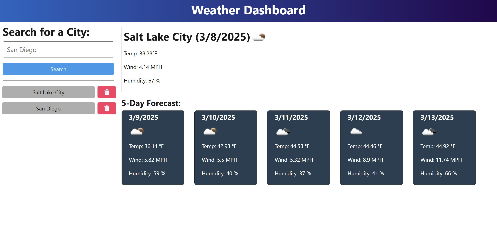

  # Weather Dashboard   
  
  ## Description 

  Find 5-day weather forecast for any city.

  

  ## Table of Contents

  - [Installation](#installation)
  - [Usage](#usage)
  - [License](#license)
  - [Dev](#dev)

  ## Installation

  Download the repo, navigate to the [Open Weather API Website](https://api.openweathermap.org/) and create an account to obtain an API key, navigate to the server folder and rename the .env.EXAMPLE to .env, populate an API key in the .env, open Develop folder in terminal, run commands npm i, npm run start:dev.

  ## Usage

  Open the application in the browser, input the desired city into the search bar and click the search button, or select from history by clicking the name. Watch the weather forecast populate on the page!

  ## License
  This application is covered under the [MIT](https://opensource.org/licenses/MIT) license.
  

  ## Dev
  
  Try the app on [render](https://weather-dashboard-mhd-2025.onrender.com/).

  Check out the [code](https://github.com/michaelhdavies/weather-dashboard).

  Developed by [Michael Henry Davies](https://github.com/michaelhdavies/).

  [Back to Top](#description)
  
  